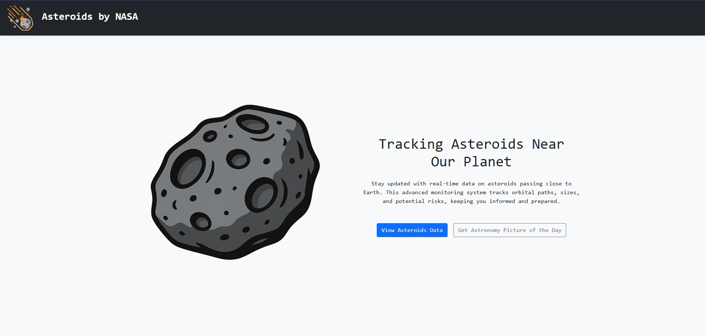
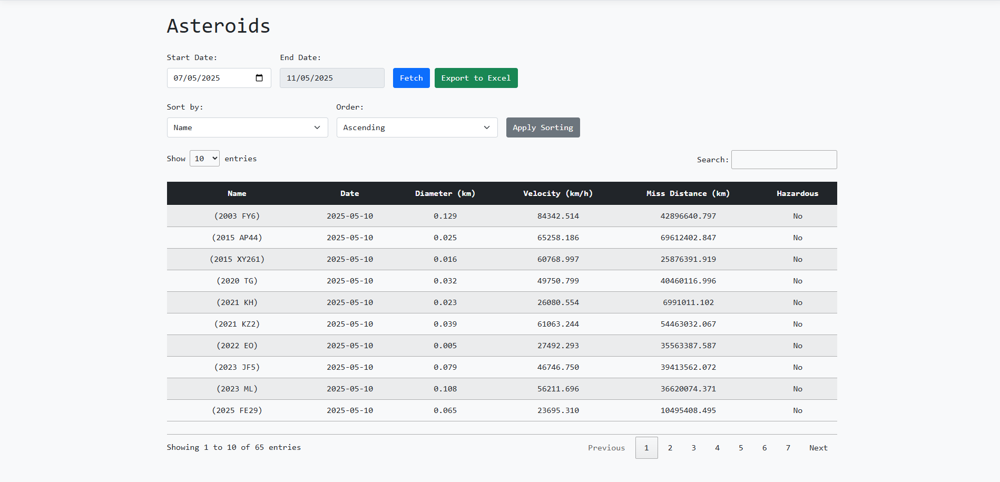
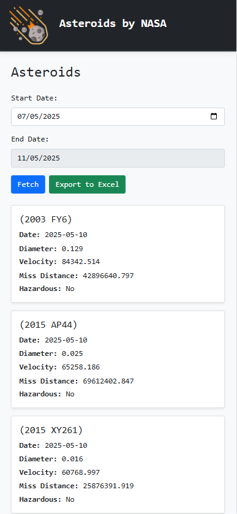
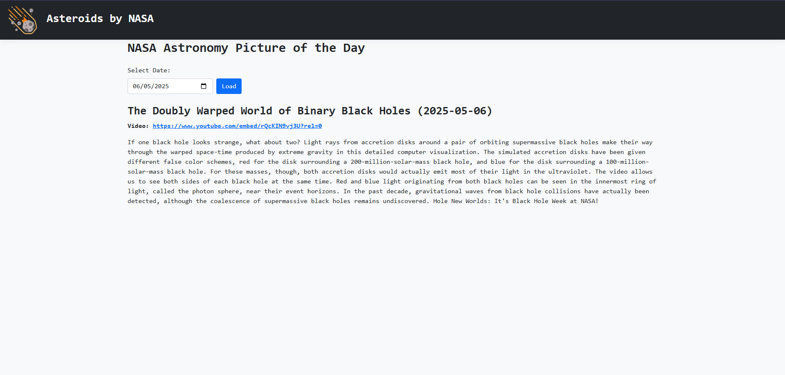

# NASA Explorer — ASP.NET Core MVC Project

A web application built with ASP.NET Core MVC that interacts with NASA's public REST APIs to display:

- Near-Earth Asteroids (NEO)
- Astronomy Picture of the Day (APOD)

## Features

- **Asteroids Browsing**: Search NEOs by date range using NASA NeoWs API.
- **Astronomy Picture of the Day**: View NASA’s daily space image or video with full description.
- **Excel Export**: Download asteroid data as `.xlsx` files using ClosedXML.
- **Sort**: Sort asteroids by name, date, size, and more.
- **Searching & Paging**: Find and structure asteroids data easily.
- **Responsive UI**: Optimized for desktop, tablet, and mobile.
- **Unit Testing**: Covered with xUnit for key logic and features.

## Technologies Used

- ASP.NET Core MVC
- NASA APIs (NeoWs, APOD)
- ClosedXML (Excel export)
- xUnit (Unit Testing)
- Bootstrap, CSS
- Vanilla JavaScript

## Setup Instructions

1. **Clone the repository**
    ```bash
    git clone https://github.com/HristiyanBratov/NASA-Explorer.git
    cd NASA-Explorer
    ```

2. **Set up API Key**
    - Sign up at [api.nasa.gov](https://api.nasa.gov) to get a key.
    - Add your key to `appsettings.json`:
      ```json
      {
        "NASA": {
          "ApiKey": "API-KEY-HERE"
        }
      }
      ```

3. **Restore packages**
    ```bash
    dotnet restore
    ```

## Project Structure (N-Tier Architecture)

- `Asteroids.Models` — Models & DTOs for NEOs and APOD.
- `Asteroids.Services` — API integration logic and service interfaces.
- `Asteroids.Utility` — Configuration and API key management.
- `Asteroids.Tests` — Unit test project using xUnit.
- `AsteroidsWeb` — Controllers, Views, JavaScript.

## DEMO of the project

### Main Page:


### Astroids View


### Asteroids View - Mobile


### Astronomy Picture of the Day



## Author

**Hristiyan Bratov**

